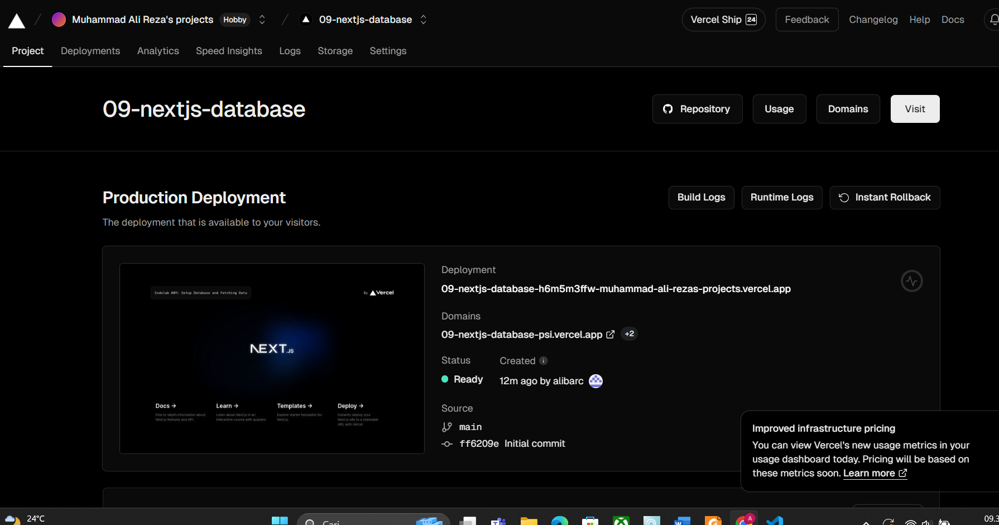

Nama : Muhammad Ali Reza  
NIM : 2041720182  
Kelas : TI 3F  

## SOAL 1

Hasil deploy seperti gambar berikut , ini adalah hasil akun vercel yang telah dihubungkan dengan github dan inisialisasi project ini

 

## SOAL 2

Database postgres telah berhasil dibuat dan terkoneksi dengan project ini

 

## SOAL 3

Pada pertama run maka hasilnya terjadi error dikarenakan terdapat modul yang belum di install

Setelah menginstall module maka hasil akan seperti berikut

 

## SOAL 4

Hasil run dari query adalah sebagai berikut, disini kita mencari nama customer nama dan tagihan berdasarkan customer id

 